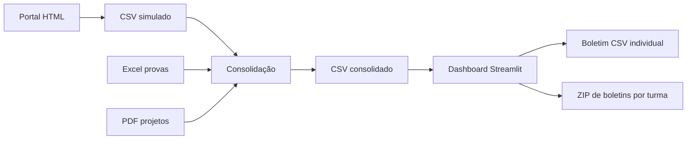

# School Data Pipeline


Pipeline em Python para extrair, consolidar e publicar dados escolares: notas de simulado, provas e projeto pedagógico, com médias ponderadas, boletins e dashboard.

**Status:** v1 concluída — etapas 1 a 7 implementadas; **8_v2** permanece como backlog de melhorias.

> Este projeto será revisitado muitas vezes: pretendo reler cada etapa aos poucos, compreender melhor o código e ir refinando a solução com o tempo.

## Por que este projeto existe

Esta é minha **primeira automação** em Python.

Depois de um primeiro contato com automação (inspirado por material introdutório da Hashtag Treinamentos), quis aplicar o que estava aprendendo em algo ligado à minha rotina em sala de aula. Em vez de um exemplo genérico, escolhi simular uma situação que coordenação e professores reconhecem: juntar notas de fontes diferentes, calcular médias e transformar tudo em boletins e indicadores.

O foco aqui não é substituir um sistema escolar real, e sim **praticar automação com um contexto educacional fictício**, próximo da realidade do dia a dia.

## O que o pipeline faz (visão geral)

Simula a rotina de uma coordenação escolar com um **pipeline ponta a ponta**:

1. **Automatizar o portal** — com PyAutoGUI, o sistema acessa o portal local, faz login e baixa os CSVs de simulado simulando a interação humana (RPA).
2. **Processar os dados** — lê notas de CSV, Excel e PDF e consolida tudo em uma base única.
3. **Aplicar regras pedagógicas** — calcula médias ponderadas e define aprovação ou recuperação.
4. **Disponibilizar resultados** — salva a base consolidada em CSV e oferece, no dashboard, boletins individuais para download em CSV ou um arquivo ZIP com todos os boletins da turma selecionada.

**Escola fictícia:** Colégio Caminhos do Futuro  
**Turmas:** 6º, 7º e 8º ano matutino

> Cenário inspirado na rotina escolar: várias fontes de nota, portal sem API e tarefas repetitivas que podem ser automatizadas.

## Fluxo do pipeline



## Progresso

**7 de 8 etapas concluídas** · etapa **8_v2** em backlog

<p align="center">
  
</p>

| Situação | Significado |
|----------|-------------|
| anel fechado ✓ | concluído |
| anel parcial (%) | em andamento |
| anel vazio | pendente |
| anel tracejado | backlog |

Detalhes de cada etapa em **[detalhamento.md](detalhamento.md)**.

## Aprendizados (até aqui)

- Primeira automação em Python: o fluxo parecia complexo no início, mas repetir funções e mapear coordenadas com PyAutoGUI foi tornando o processo compreensível.
- A partir da consolidação, boletins e dashboard, a densidade de conteúdo aumentou: imports entre módulos, regras de média, HTML e Streamlit exigiram mais pausas para entender cada parte.
- Não considero o projeto “encerrado na minha cabeça”: volto a ele para revisar etapas, testar execuções e melhorar aos poucos.

Registro completo por desafio em **[detalhamento.md](detalhamento.md)**.

## Resultados da v1

<table>
  <tr>
    <td width="50%" align="center"><strong>Portal fictício</strong></td>
    <td width="50%" align="center"><strong>Fontes de dados simuladas</strong></td>
  </tr>
  <tr>
    <td width="50%"></td>
    <td width="50%"></td>
  </tr>
  <tr>
    <td width="50%" align="center"><sub>Login local do ambiente de demonstração.</sub></td>
    <td width="50%" align="center"><sub>Três formatos diferentes de entrada.</sub></td>
  </tr>
  <tr>
    <td width="50%" align="center"><strong>Base consolidada</strong></td>
    <td width="50%" align="center"><strong>Boletim individual</strong></td>
  </tr>
  <tr>
    <td width="50%"></td>
    <td width="50%"></td>
  </tr>
  <tr>
    <td width="50%" align="center"><sub>Notas unidas por turma, aluno e disciplina.</sub></td>
    <td width="50%" align="center"><sub>Boletim individual em HTML gerado na primeira versão do projeto.</sub></td>
  </tr>
  <tr>
    <td colspan="2" align="center"><strong>Dashboard escolar</strong></td>
  </tr>
  <tr>
    <td colspan="2"></td>
  </tr>
  <tr>
    <td colspan="2" align="center"><sub>Indicadores agregados com filtro por turma.</sub></td>
  </tr>
</table>

## Automação RPA — evidências (Desafio 3)

O script [`src/automacao_portal.py`](src/automacao_portal.py) abre o portal no Chrome, faz login, navega pelas três séries e aciona o download dos CSVs de simulado.

### Ambiente calibrado

| Item | Valor |
|------|-------|
| Resolução do monitor | 1920×1080 |
| Escala do Windows | 125% (1536×864 lógico) |
| Navegador | Google Chrome maximizado |
| Zoom do navegador | 100% |

> As coordenadas do PyAutoGUI foram mapeadas nesse ambiente. Se o fluxo falhar em outra máquina, ajuste resolução, escala ou zoom antes de recalibrar.

### Demonstração

<table>
  <tr>
    <td width="50%" align="center"><strong>Mapeamento de coordenadas com PyAutoGUI</strong></td>
    <td width="50%" align="center"><strong>Fluxo e coleta de dados no portal de notas</strong></td>
  </tr>
  <tr>
    <td width="50%"></td>
    <td width="50%"></td>
  </tr>
  <tr>
    <td width="50%" align="center"><sub>Pausa no código, mouse sobre o elemento e leitura da coordenada no terminal.</sub></td>
    <td width="50%" align="center"><sub>Login, navegação pelas séries e download dos CSVs.</sub></td>
  </tr>
</table>


### Como executar

Instale as dependências:

```bash
pip install -r requirements.txt
```

Execute o fluxo completo — automação do portal e consolidação das notas:

```bash
python main.py
```

Esse comando gera ou atualiza o arquivo:

```text
saidas/relatorios/notas_consolidadas.csv
```

Em seguida, abra o dashboard:

```bash
streamlit run dashboard.py
```

No dashboard, selecione uma turma. Você pode baixar o boletim individual de um aluno em CSV ou baixar os boletins de todos os alunos da turma em um arquivo ZIP.

Se os arquivos de entrada já estiverem disponíveis e você quiser apenas consolidar os dados, sem executar a automação do portal, use:

```bash
python -m src.consolidacao
```

Requisitos: Chrome instalado no caminho padrão (para o RPA) e dependências em `requirements.txt`.


## Como construir o projeto

O desenvolvimento é organizado em desafios descritos em **[detalhamento.md](detalhamento.md)**.

Cada desafio define contexto, requisitos, entradas, saídas e critérios de aceite — sem prescrever a implementação. A ideia é ir resolvendo aos poucos, pesquisando e praticando cada etapa.

## Estrutura do repositório

```text
school-data-pipeline/
├── dados/
│   ├── simulados/
│   ├── provas/
│   └── projetos/
├── docs/
│   ├── capturas/
│   ├── gerar_capturas.py
│   ├── progresso-etapas.svg
│   └── progresso-etapas.png
├── gifs/
│   ├── rpa-mapeamento-coordenadas.gif
│   └── rpa-fluxo-completo-portal.gif
├── portal_simulado/
├── src/
│   ├── automacao_portal.py
│   ├── boletins.py
│   ├── consolidacao.py
│   ├── leitor_projetos.py
│   ├── leitor_provas.py
│   └── leitor_simulados.py
├── dashboard.py
├── main.py
├── saidas/
│   ├── relatorios/
│   └── prints/
├── detalhamento.md
├── requirements.txt
└── README.md
```

## Fontes de dados (simuladas)

| Fonte | Formato | Origem fictícia |
|-------|---------|-----------------|
| Simulado | CSV | Portal HTML local |
| Provas | Excel | Professores |
| Projeto pedagógico | PDF | Coordenação |

## Tecnologias

| Uso | Ferramenta |
|-----|------------|
| Automação de interface (RPA) | PyAutoGUI |
| Leitura e consolidação de dados | Pandas, OpenPyXL, PDFPlumber |
| Dashboard | Streamlit, Plotly |
| Linguagem | Python |

Dependências listadas em `requirements.txt`.

## Material de apoio — Pathlib e Shutil

Guia em PDF (texto selecionável) com exemplos alinhados ao **School Data Pipeline** — caminhos com `Path`, `glob`, `mkdir`, `read_text`/`write_text` e `shutil.move`:

**[Baixar Pathlib_e_Shutil_em_Python.pdf](https://raw.githubusercontent.com/GustaFranz/exercicios_python/main/materiais/python/Pathlib_e_Shutil_em_Python.pdf)** · [exercicios_python/materiais](https://github.com/GustaFranz/exercicios_python/tree/main/materiais/python)

## Portal simulado (login fictício)

Abra `portal_simulado/login.html` no navegador.

- **Email:** `coordenacao@colegiocaminhosfuturo.local`
- **Senha:** `Demo@2026`

## Transparência

O portal escolar do **School Data Pipeline** é uma **simulação local**. Não representa nenhuma instituição real e não utiliza dados pessoais de alunos.

Parte do material inicial (como o portal HTML) foi estruturada com apoio de ferramentas de IA, sempre dentro de um cenário fictício e educacional.
